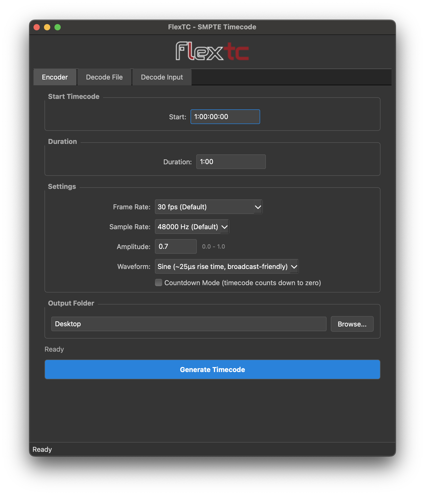
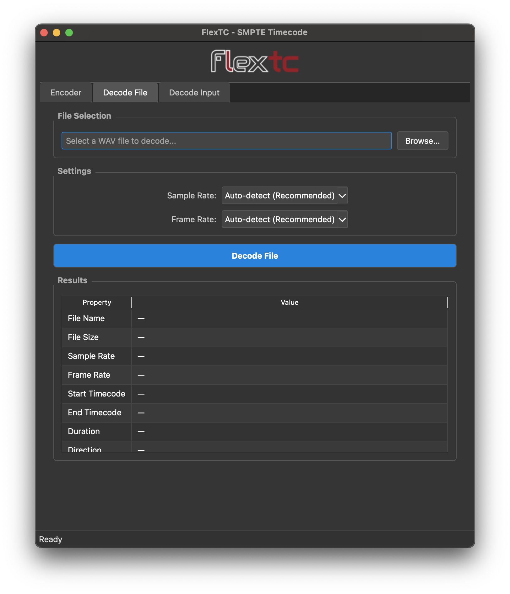
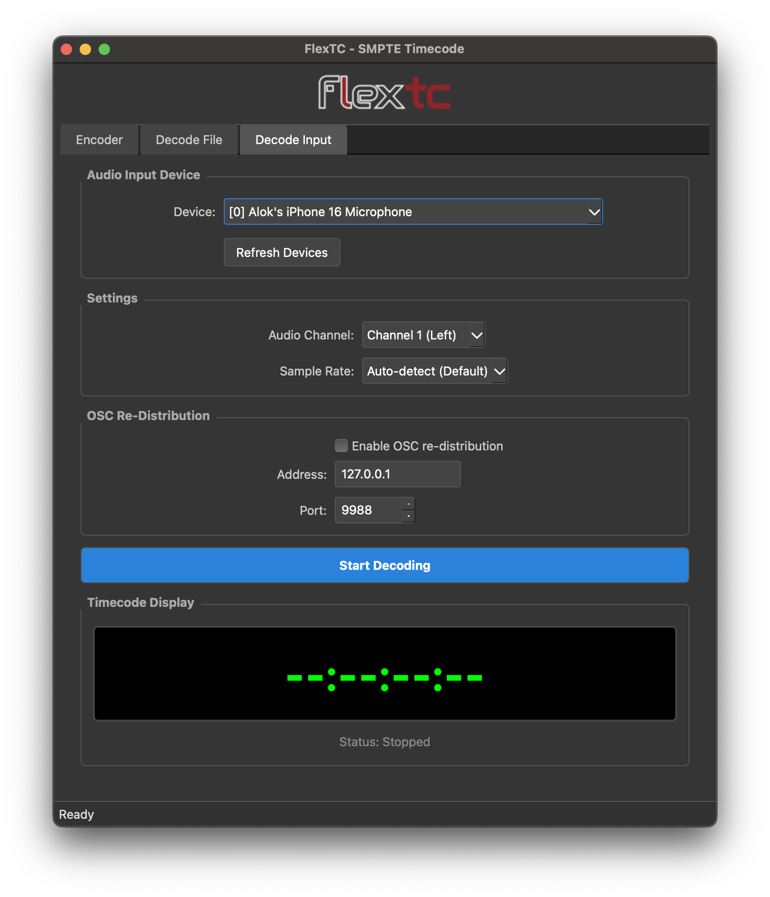

# FlexTC - SMPTE-Compatible, Flexible, Bi-Directional, Extended Timecode

A SMPTE/LTC backwards-compatible timecode encoder/decoder that supports both standard count-up timecode and countdown mode. Uses native Biphase-M (Manchester) encoding for compatibility with standard SMPTE equipment. The decoder can also re-distribute input timecode as an OSC string, for easy reference in other software.

<a href="https://www.buymeacoffee.com/alokw" target="_blank"></a>

## Quick Start

**Just want to use FlexTC without installing Python?**

Download the latest pre-built application for your operating system from the [**Releases**](../../releases) page:

- **Windows**: Download `FlexTC-Windows.zip`, extract, and run `FlexTC.exe`
- **macOS**: Download `FlexTC-macOS.zip`, extract, and open `FlexTC.app`

No Python installation required! The standalone applications include everything you need.


## Screenshots

<table>
  <tr>
    <td width="45%" rowspan="2" align="center">
      <br>
      <em>Generate timecode files with count-up or countdown modes</em>
    </td>
    <td width="20%" align="center">
      <br>
      <em>Analyze timecode from WAV files</em>
    </td>
  </tr>
  <tr>
    <td align="center">
      <br>
      <em>Real-time decoding from audio input</em>
    </td>
  </tr>
</table>


## Overview

FlexTC provides two modes of operation:

1. **Countdown Mode**: Timecode counts down to zero - useful for timers, countdowns, remaining time display
2. **Count-Up Mode (Standard SMPTE)**: Traditional SMPTE timecode counting up from a specific start time

Both modes produce valid SMPTE/LTC audio that can be read by standard decoders. The direction is indicated by bit 60 of the frame.

## Key Features

- **Bidirectional Timecode** - Countdown and count-up modes in a single stream
- **Extended Hours** - Support up to 159 hours (beyond standard SMPTE's 39-hour limit)
- **Auto-Detection** - Automatic frame rate and sample rate detection
- **Freewheeling** - Smooths out single-frame glitches through interpolation
- **OSC Re-Distribution** - Periodic Real-time timecode distribution via OSC as a string, for reference use
- **GUI Interface** - Optional desktop GUI for encoding and decoding
- **Broadcast-Friendly** - Sine waveform option reduces harmonics

## System Architecture

```
┌─────────────────┐          ┌─────────────────┐         ┌─────────────────┐
│  SMPTE Encoder  │──WAV───▶│  Audio Player   │──XLR───▶│  SMPTE Decoder  │
│                 │          │                 │         │                 │
│ Bidirectional   │          │ Playback device │         │ Auto-detects    │
│ timecode gen    │          │ (any system)    │         │ direction       │
│ 0-159 hours     │          │                 │         │ Freewheeling    │
└─────────────────┘          └─────────────────┘         └─────────────────┘
                                                              │
                                                              ▼
                                                         ┌─────────────┐
                                                         │ OSC Output  │
                                                         │ (optional)  │
                                                         └─────────────┘
```

## Installation from Source

```bash
# Install in editable/development mode (recommended)
pip install -e .

# Install with GUI support
pip install -e ".[gui]"

# This installs the console commands:
#   flextc-encode  - Generate timecode audio
#   flextc-decode  - Read timecode from audio
#   flextc-gui     - Launch graphical interface
```

### Graphical Interface (GUI)

The easiest way to use FlexTC is through the GUI. If you downloaded a pre-built release, just run the application. If you installed from source:

```bash
flextc-gui
```

**GUI Features:**
- **Encoder Tab**: Generate timecode files with visual controls
- **Decode File Tab**: Analyze timecode from WAV files
- **Decode Input Tab**: Real-time decoding from audio input with live timecode display

All parameters from the CLI are available in the GUI, including frame rate, drop-frame mode, countdown mode, and OSC settings.


## Usage

### Console Commands

```bash
# Encode timecode (output filename auto-generated if -o not specified)
flextc-encode 5m                      # Generates: ltc_30fps_5m.wav
flextc-encode 5m --countdown          # Generates: count_30fps_5m.wav

# Decode from file
flextc-decode -i ltc_30fps_5m.wav

# Decode from live audio
flextc-decode

# Show help
flextc-encode --help
flextc-decode --help
```

### Encoder

```bash
# Basic usage - count-up (default)
flextc-encode 5m                      # 5 minutes
flextc-encode 1:30                    # 1 min 30 sec

# Countdown mode
flextc-encode 5m --countdown

# Frame rate options
flextc-encode 10m -r 25               # 25 fps (PAL)
flextc-encode 10m -r 23.98            # 23.98 fps (film/HD)
flextc-encode 10m -r 24               # 24 fps (film production)
flextc-encode 10m -r 29.97            # 29.97 fps non-drop (NTSC)
flextc-encode 10m -r 29.97 --drop-frame  # 29.97 fps drop-frame

# Start from specific timecode
flextc-encode 10s --start 1:00:00:00  # Start from 1 hour
flextc-encode 1m --start 99:00:00:00  # Start from 99 hours (extended mode)

# Sample rate and amplitude
flextc-encode 5m -s 44100             # 44.1 kHz sample rate
flextc-encode 5m -a 0.5               # Lower amplitude (0.0 to 1.0)

# Waveform type
flextc-encode 5m                     # Sine waveform (default, broadcast-friendly)
flextc-encode 5m --square             # Square waveform (~1μs rise time)
```

**Timecode Duration Formats:**
- `10s`, `5m`, `1h` - Simple duration
- `1:30` - Minutes:seconds
- `2h30m` - Compound format
- `7h6m5s4f` - Hours, minutes, seconds, frames

**Auto-generated filename format:**
- Count-up: `ltc_{rate}fps{_drop}_{start}_{duration}.wav`
- Countdown: `count_{rate}fps{_drop}_{start}_{duration}.wav`

### Decoder

```bash
# Decode from default audio input (live)
flextc-decode

# Decode from specific device and channel
flextc-decode -d 2 -c 1

# Decode from file
flextc-decode -i output.wav

# List available audio devices
flextc-decode --list-devices

# Verbose output with statistics
flextc-decode -v

# Decode and distribute timecode via OSC
flextc-decode -d 2 -c 1 --osc --osc-address 127.0.0.1
```

**Display Indicators:**
- **▲** = Counting up (standard SMPTE)
- **▼** = Counting down (countdown mode)
- `:` (colon) = Non-drop frame timecode (HH:MM:SS:FF)
- `;` (semicolon) = Drop-frame timecode (HH:MM:SS;FF)

Example output:
```
▼ 00:04:23;15  (packets: 3842)    # Countdown mode (drop-frame)
▲ 01:23:45:12  (packets: 5021)    # Count-up mode (non-drop)
```

## Frame Rates

| Frame Rate | Option | Description | Drop-Frame |
|------------|--------|-------------|------------|
| 23.98 fps | `-r 23.98` | Film (24 × 1000/1001), HD video | No |
| 24 fps | `-r 24` | Film production | No |
| 25 fps | `-r 25` | PAL video | No |
| 29.97 fps | `-r 29.97` | NTSC timecode | Optional |
| 30 fps | `-r 30` | Standard audio/video (default) | Optional |

**Note:** Non-drop frame rates (23.98, 24, 30, 29.97 NDF) encode identically in bits 10-11. Decoders distinguish them by measuring actual bit timing from the audio.

## OSC Re-Distribution

The decoder can send decoded timecode via OSC for integration with other systems. This allows software like show control systems, DAWs, or custom applications to receive and display the timecode.

**Important:** OSC re-distribution is sent periodically (approximately every 100ms), not on every frame. This feature is intended for display and reference purposes only and should not be used for frame-accurate triggering or synchronization.

```bash
# Send to localhost
flextc-decode --osc --osc-address 127.0.0.1

# Send to specific IP and port
flextc-decode --osc --osc-address 192.168.1.100 --osc-port 9999
```

**OSC Options:**
- `--osc` - Enable OSC re-distribution
- `--osc-address` - Target IP address (default: 127.0.0.1)
- `--osc-port` - UDP port (default: 9988)

**OSC Paths:**
- `/flextc/ltc` - Sent when counting up (standard SMPTE mode)
- `/flextc/count` - Sent when counting down (countdown mode)

**Message Format:** Single string argument in format `HH:MM:SS:FF` or `HH:MM:SS;FF` (for drop-frame).

## Freewheeling

The decoder includes a **freewheeling** feature that smooths out single-frame glitches by intelligently interpolating timecode values when corrupted frames are detected.

### How It Works

1. **Glitch Detection** - When an incoming timecode deviates significantly from the expected value (more than 2 frames), the decoder enters freewheel mode

2. **Interpolation** - Instead of displaying the corrupted value, the decoder continues incrementing from the last known good timecode at the detected frame rate

3. **Catch-Up Detection** - If the incoming timecode "catches up" to the expected freewheeled value, normal decoding resumes

4. **Timeout** - If the timecode doesn't catch up within 0.25 seconds, the decoder accepts the jump (which may be a legitimate seek or intentional change)

### Benefits

- **Smooth Display** - Single-frame glitches don't cause visible jumps in the displayed timecode
- **Fast Recovery** - Legitimate timecode changes are accepted within 0.25 seconds
- **Direction Aware** - Freewheeling respects the current count-up/countdown direction

This feature is particularly useful in noisy audio environments or when decoding from marginal signal sources.

## Specification

### Frame Structure

| Bits | Field | Description |
|------|-------|-------------|
| 0-3 | Frame units | Frames % 10 (BCD) |
| 4-7 | User bits field 1 | User data |
| 8-9 | Frame tens | Frames // 10 (BCD) |
| 10 | Drop frame flag | 1 = 29.97 df, 0 = non-drop |
| 11 | Color frame flag | 1 = 25 fps |
| 16-19 | Seconds units | Seconds % 10 (BCD) |
| 24-26 | Seconds tens | Seconds // 10 (BCD) |
| 32-35 | Minutes units | Minutes % 10 (BCD) |
| 40-42 | Minutes tens | Minutes // 10 (BCD) |
| 48-51 | Hours units | Hours % 10 (LSB first) |
| 52-53 | Hours padding | Set to 00 (reserved) |
| 54-57 | Hours tens | Hours // 10 (FlexTC extended) |
| 58 | Clock flag | External clock sync |
| 59 | BGF / Polarity | Binary group flag / polarity |
| 60 | **Direction flag** | **0=count-up, 1=countdown** |
| 61-63 | User bits field 8 (partial) | User data |
| 64-79 | Sync word | Fixed: 0011 1111 1111 1101 |

### Direction Indicator

Bit 60 indicates the timecode direction:
- **Bit 60 = 0**: Counting up (standard SMPTE mode)
- **Bit 60 = 1**: Counting down (countdown mode)

When decoding from files, direction is determined by comparing first and last timecode values for compatibility with standard LTC files.

### Extended Hours Encoding

The SMPTE specification uses only 2 bits for hours tens (bits 56-57), allowing 0-39 hours. FlexTC extends this to **159 hours** using bits 54-57:

| Hours Range | Encoding Mode | Standard Decoder Sees |
|-------------|---------------|----------------------|
| 0-39 | BCD (SMPTE compatible) | Correct hours ✓ |
| 40-159 | Binary (FlexTC extended) | Incorrect hours |

**Bit Error Robustness:** With 4-bit tens encoding (max 159 hours), the maximum single-bit error is ±80 hours (vs ±320 hours with 6-bit encoding), making high hour values much more reliable.

## Technical Details

### Biphase-M Encoding

FlexTC uses Biphase-M (Manchester) encoding per SMPTE 12M:
1. Every bit cell starts with a transition
2. Logic 0: Additional transition in middle of cell
3. Logic 1: No transition in middle

This ensures guaranteed clock recovery, DC-free encoding, and robustness to polarity inversion.

### Waveform Types

| Waveform | Description | Rise Time | Use Case |
|----------|-------------|-----------|----------|
| **Sine** | Smooth sinusoidal transitions | ~25μs | Default; broadcast-friendly |
| **Square** | Instant transitions | ~1μs | Traditional hardware LTC |

Both waveforms produce identical timecode data - only the spectral content differs.

### Decoder Features

- **Sync word detection** - Reliable frame identification with 2-bit error tolerance
- **Auto frame rate detection** - From bits 10-11 and edge timing analysis
- **Auto sample rate detection** - From audio device default
- **Direction auto-detection** - From bit 60 and timecode comparison
- **Fractional timing support** - Accurate 29.97/23.98 fps encoding
- **Corruption recovery** - Automatic reset on decoder misalignment
- **Signal loss detection** - 500ms timeout with automatic re-detection

### Decoder State Machine

**Detection Mode**
- Entered on startup or signal loss
- Fast initial lock with 0.05 seconds of audio
- Tries multiple buffer alignments if needed
- Clears buffer when signal returns after silence

**Locked Mode**
- Processing timecodes continuously
- 500ms signal loss timeout for recovery
- Automatic biphase decoder reset on corruption

**Corruption Recovery**
- Stuck Frames: Same timecode repeats 5+ times
- Invalid Frames: Frames but no valid timecodes (10 consecutive)
- No Frames: Strong signal but no decoded frames (3 consecutive)

## Tested With

| Hardware/Software | Notes |
|-------------------|-------|
| **FlexTC Decoder** | Full support up to hour 159 |
| **TouchDesigner** | Bi-directional, up to hour 39 |
| **Horae** | Bi-directional, up to hour 39 |
| **Brainstorm SR-112** | Forward timecode, up to hour 23 |
| **GrandMA3** | Bi-directional, up to hour 39 |
| **Horita TR-100** | Bi-directional, up to hour 23 |

## Building Standalone Applications

FlexTC GUI can be packaged as standalone applications for macOS and Windows using PyInstaller.

### Prerequisites

```bash
# Install PyInstaller
pip install pyinstaller pillow
```

### Building on macOS

```bash
# Use the provided build script
./build_mac.sh

# Or build manually
pyinstaller flextc_gui.spec

# The output app bundle will be at: dist/FlexTC.app
# To run: open dist/FlexTC.app
```

### Building on Windows

```cmd
# Use the provided build script
build_windows.bat

# Or build manually
pyinstaller flextc_gui.spec

# The output executable will be at: dist\FlexTC\FlexTC.exe
```

### Distribution

- **macOS**: Create a ZIP archive of `dist/FlexTC.app` for distribution
- **Windows**: Create a ZIP archive of the `dist/FlexTC` folder for distribution

The standalone applications include all dependencies and do not require Python to be installed on the target system.

## Requirements

- Python 3.9+
- numpy
- soundfile
- sounddevice
- scipy (for file resampling)
- python-osc (for OSC re-distribution)
- PySide6 (for GUI, optional)

## License

MIT

## Contributing

Contributions welcome! Please open issues or PRs.
